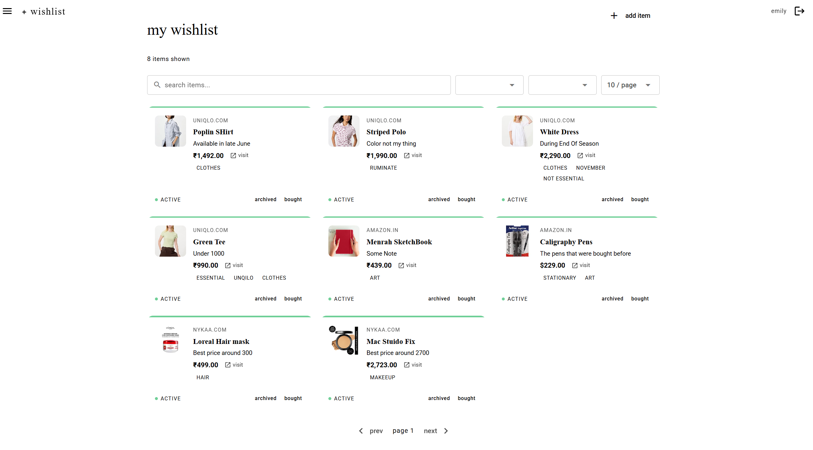
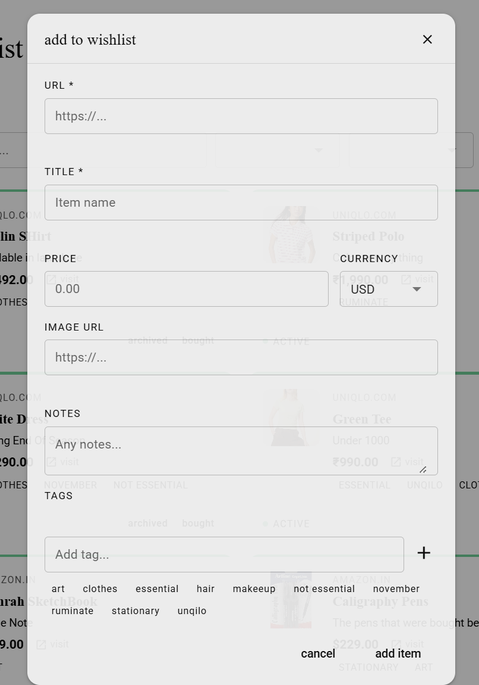
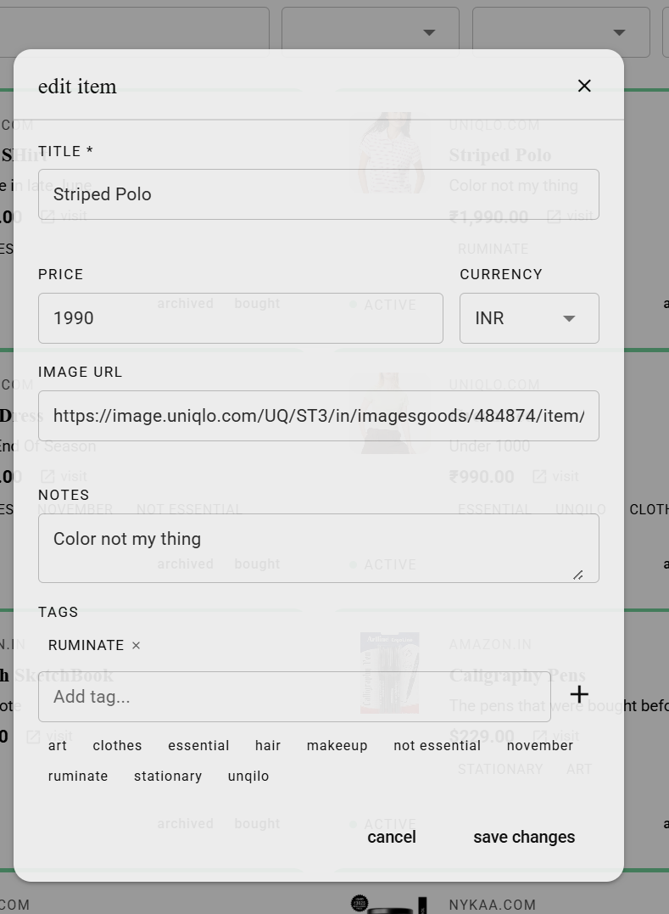

# Wishlist Application

A full-stack web application built using **ASP.NET Core Web API** and **Quasar (Vue.js)** for managing personal wishlist items with tagging, filtering, and status tracking.

This project focuses on clean architecture, efficient database usage, and production-relevant backend practices aligned with modern .NET development.

---

## 🛠️ Tech Stack

### Backend

- **Language:** C#
- **Framework:** ASP.NET Core Web API
- **ORM:** Entity Framework Core
- **Database:** SQL Server

### Frontend

- **Framework:** Vue 3 (Quasar Framework)
- **State Management:** Pinia
- **HTTP Client:** Axios

---

## ✨ Key Features

- **Full CRUD Operations:** Seamless management of wishlist items.
- **Tagging System:** Organized via a relational many-to-many relationship.
- **Advanced Filtering:** Quickly filter items by specific tags and current status.
- **Partial Updates:** Efficient delta updates utilizing standard HTTP PATCH semantics.
- **User-Scoped Data Access:** Strict security boundary ensuring users only access their own data.
- **Optimized Pagination:** High-performance data fetching designed to minimize database load.

---

## 📸 Screenshots

| Dashboard                               | Add Item                             |
| --------------------------------------- | ------------------------------------ |
|  |  |

| Update Item                            | Filter                            |
| -------------------------------------- | --------------------------------- |
|  |  |

---

## 🧠 Backend Design Highlights (Credibility Section)

| Architecture / Pattern           | Implementation Details & Production Benefits                                                                                                                                                                               |
| :------------------------------- | :------------------------------------------------------------------------------------------------------------------------------------------------------------------------------------------------------------------------- |
| **1. Efficient Query Execution** | Uses `IQueryable<T>` to defer execution. Filtering, pagination, and sorting are executed strictly at the database level, avoiding loading unnecessary data into web server memory.                                         |
| **2. N+1 Query Prevention**      | Leverages explicit loading via `.Include(x => x.WishlistItemTags).ThenInclude(x => x.Tag)` to fetch related data in a single, optimized SQL query.                                                                         |
| **3. Repository Pattern**        | Abstracts the data access layer away from controllers instead of directly exposing `DbContext`. Isolates data access logic, keeps controllers thin, and makes the application easily mockable for unit testing.            |
| **4. DTO-Based API Design**      | Uses Data Transfer Objects (DTOs) to decouple API contracts from internal database schemas. This prevents overexposing data, stops circular reference issues, and eliminates tight coupling.                               |
| **5. Partial Updates (PATCH)**   | Implements partial resource updates using null-check patterns (e.g., `if (dto.Title != null) entity.Title = dto.Title;`), respecting the semantic difference between PUT and PATCH.                                        |
| **6. Secure User Isolation**     | All queries are scoped using the authenticated user ID extracted from JWT claims (`w.UserId == userId`). To prevent resource enumeration/guessing attacks, the API returns a `404 Not Found` instead of a `403 Forbidden`. |
| **7. Relational Tag Integrity**  | Implements the many-to-many relationship via a dedicated join table using a composite primary key: `.HasKey(x => new { x.WishlistItemId, x.TagId });` to enforce uniqueness without unnecessary surrogate keys.            |
| **8. Tag Normalization**         | Tags are normalized at write time using `dto.Name.ToLower().Trim()`. Paired with a unique index on `(UserId, Name)`, this strictly prevents duplicate tags caused by casing or whitespace inconsistencies.                 |
| **9. Controlled Tag Creation**   | Dynamically created tags use immediate persistence (`SaveChangesAsync()`) to materialize database-generated IDs before linking. _Future improvement: leverage EF Core relationship fixup for unified batching._            |
| **10. Optimized Pagination**     | Computes a lightweight `HasMore = skip + items.Count < totalCount` check instead of running heavy, repetitive `COUNT(*)` queries on every request. _Future improvement: implement cursor-based pagination._                |
| **11. URL Domain Extraction**    | Handles domain parsing cleanly using the Base Class Library (BCL) method `Uri.TryCreate(url, UriKind.Absolute, out var uri)`. This avoids fragile, error-prone string manipulation.                                        |
